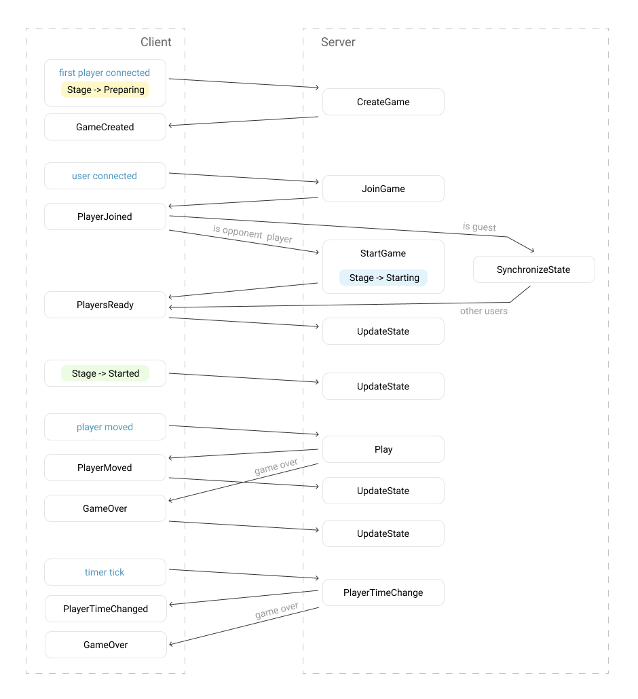

# Tic Tac Toe
Simple Tic-Tac-Toe game with Blazor Server and SignalR

## Communication flow

Actions called on server:
 - CreateGame
 - JoinGame
 - StartGame
 - SynchronizeState
 - UpdateState
 - Play
 - PlayerTimeChange

Events raised on client:
 - GameCreated
 - PlayerJoined
 - PlayersReady
 - PlayerMoved
 - PlayerTimeChanged
 - GameOver
