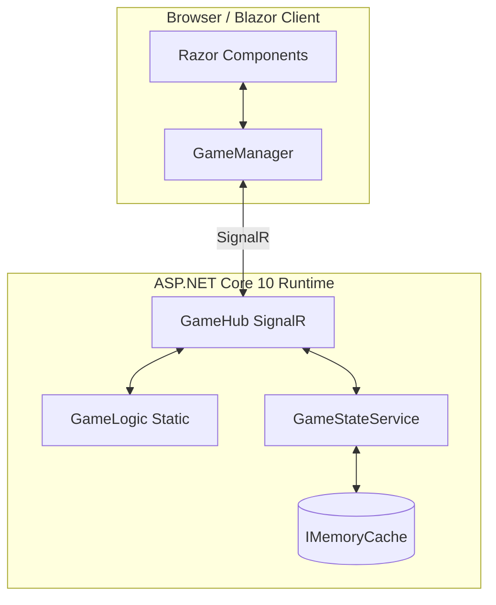
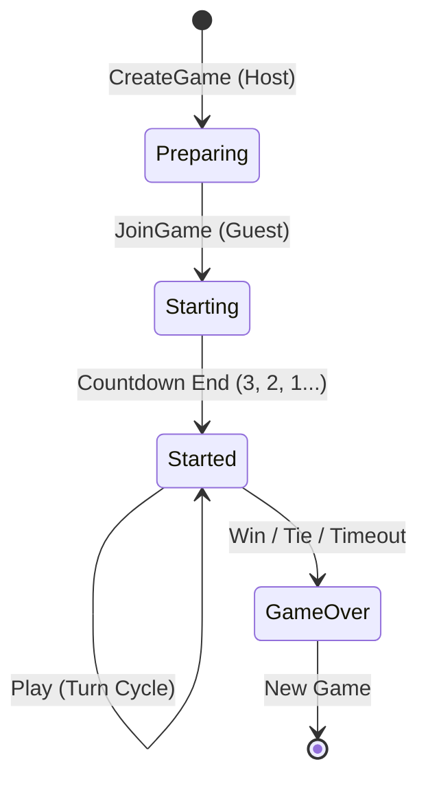

# 🎮 Tic Tac Toe (.NET 10 + SignalR)

Modern, real-time multiplayer Tic-Tac-Toe game built with **ASP.NET Core 10.0**, **Blazor Server** (Interactive Server mode), and **SignalR**.

## 🚀 Overview

This project is a high-performance, resilient web application demonstrating modern .NET 10 capabilities. It features real-time synchronization, session persistence across page refreshes, and a fully reactive UI.

### Key Features
- **Real-time Multiplayer**: Powered by SignalR for sub-millisecond updates.
- **State Resilience**: Uses `IMemoryCache` on the server to ensure games continue seamlessly after a page refresh (F5).
- **Modern .NET 10 Architecture**:
    - **Constructor Injection** in Razor components.
    - **Optimized Asset Management** using the `@Assets` dictionary for fingerprinting and caching.
    - **Minimal API** hosting model.
- **Visual Polish**: Responsive design using **Dart Sass**, custom fonts, and interactive animations. Styles are compiled automatically during build using `AspNetCore.SassCompiler`.

---

## 🏗️ Architecture

The application follows a clean separation of concerns between the communication layer, business logic, and state management.


```mermaid
graph TD
    subgraph Client [Browser / Blazor Client]
        UI[Razor Components]
        GM[GameManager]
    end

    subgraph Server [ASP.NET Core 10 Runtime]
        Hub[GameHub SignalR]
        Logic[GameLogic Static]
        Service[GameStateService]
        Cache[(IMemoryCache)]
    end

    UI <--> GM
    GM <-->|SignalR| Hub
    Hub <--> Service
    Hub <--> Logic
    Service <--> Cache
```

---

## 🕹️ Game Flow

The game transitions through several distinct stages to ensure a synchronized start for both players.


```mermaid
stateDiagram-v2
    [*] --> Preparing: CreateGame (Host)
    Preparing --> Starting: JoinGame (Guest)
    Starting --> Started: Countdown End (3, 2, 1...)
    Started --> Started: Play (Turn Cycle)
    Started --> GameOver: Win / Tie / Timeout
    GameOver --> [*]: New Game
```

### 1. Preparing
The host creates a game and receives a unique URL/QR code. The game state is initialized in the server's cache.
### 2. Starting
Once the second player joins, a 3-second synchronized countdown begins.
### 3. Started
The match is active. A server-side timer tracks each player's time. If a player exceeds their limit, the server automatically ends the game.
### 4. Game Over
The result is calculated by `GameLogic`. Players can view the final board and start a new session.

---

## 📡 Communication Protocol (SignalR)

### Server Methods (`GameHub`)
- `CreateGame`: Initializes a new session.
- `JoinGame`: Connects a second player or spectator.
- `StartCountdown`: Triggers the transition to the starting phase.
- `StartMatch`: Officially begins the match and starts timers.
- `Play`: Processes a move and validates it against the rules.
- `SynchronizeState`: Forces a state refresh (used on F5).

### Client Events (`IGameClient`)
- `GameCreated`: Notifies the host of the generated opponent ID.
- `PlayerJoined`: Alerts the host that a guest has connected.
- `PlayersReady`: Synchronizes the countdown and match start.
- `PlayerMoved`: Updates the board for all connected clients.
- `GameOver`: Notifies of the final result and reason.
- `GameNotFound`: Handled if a player tries to join an expired session.

---

## 🛠️ Development

### Prerequisites
- [.NET 10.0 SDK](https://dotnet.microsoft.com/download/dotnet/10.0) (Required to build and run from source)

### Commands
| Task | Command |
| :--- | :--- |
| **Build** | `dotnet build` |
| **Run** | `dotnet run --project TicTacToe` |
| **Clean** | `dotnet clean` |

### Configuration
Game settings like default time and intervals can be adjusted in `appsettings.json`:
```json
"GameSettings": {
  "DefaultPlayerTime": "00:00:20",
  "TimerInterval": "00:00:01"
}
```
